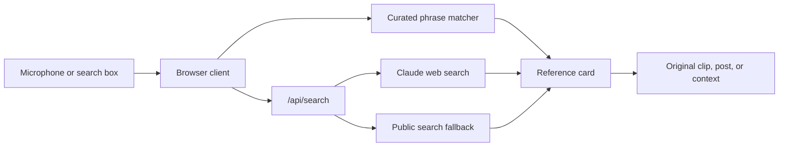

# REFER


<div align="center">

**The live culture decoder for quotes, memes, TikTok sounds, and internet lore.**

[](https://kabirkoratkar.github.io/refer/)
[](app.js)
[](https://refer-kabir.vercel.app/)
[](LICENSE)

*Hear the line. Catch the source. Get the joke.*

</div>

---

## Wait—what was that?

Refer is a voice-first reference finder for the moment a quote flies over your head. Say or type what you heard and Refer identifies the likely source, finds the original clip or post, and explains why everyone else laughed.

It covers film, television, books, games, memes, TikTok trends, viral videos, and internet slang. Microphone access is private by default and begins only when you press **Listen**.

## What Refer catches

| Signal | What happens |
| --- | --- |
| **Live speech** | Browser speech recognition builds a rolling transcript and checks recent phrases. |
| **Typed quote** | A direct search works in quiet rooms and browsers without speech recognition. |
| **Known reference** | A curated catalog supplies trusted context and verified clips when available. |
| **Unknown reference** | The API searches current social, meme, and video sources for likely originals. |
| **Source found** | Refer shows the name, origin, date, explanation, artwork, and relevant links. |
| **No exact match** | Focused searches for memes, TikTok, and X provide a useful fallback. |

## How it is built

Refer deliberately keeps the client lightweight: no frontend framework, bundler, database, or always-on server is required.



### Frontend

- [`index.html`](index.html) provides the semantic app shell and accessible controls.
- [`styles.css`](styles.css) creates the acid-yellow, cyan, pink, and purple comic-inspired interface.
- [`app.js`](app.js) contains the reference catalog, fuzzy phrase matching, speech-recognition flow, API calls, and result rendering.
- [Lucide](https://lucide.dev/) supplies interface icons, while Google Fonts provides Archivo Black, DM Mono, and Space Grotesk.

### Search API

- [`api/search.js`](api/search.js) is a Vercel serverless function.
- With `ANTHROPIC_API_KEY`, Claude searches live social and meme sources and ranks likely original posts or exact clips.
- Without the key—or when the primary search fails—the route uses a lightweight public-search fallback.
- Results are normalized, deduplicated, ranked by source quality, and enriched with a preview image when possible.
- [`vercel.json`](vercel.json) gives the search function up to 30 seconds for external lookups.

### Progressive web app

- [`manifest.webmanifest`](manifest.webmanifest) makes Refer installable as a standalone web app.
- [`service-worker.js`](service-worker.js) caches the same-origin app shell for faster repeat visits and basic offline loading.
- API requests bypass the cache so reference results remain current.

## Run it locally

### Prerequisites

- A modern version of Node.js
- [Vercel CLI](https://vercel.com/docs/cli)
- An Anthropic API key for Claude-powered search (optional; the fallback still works without one)

```bash
npm install --global vercel
export ANTHROPIC_API_KEY="your-key-here" # optional
vercel dev --listen 4173
```

Open [http://localhost:4173](http://localhost:4173) in Chrome, Edge, or Safari. Speech recognition support varies by browser; typed search remains available everywhere the app runs.

> [!NOTE]
> Serve the project over HTTP rather than opening `index.html` directly. The service worker, microphone permissions, and serverless search route require a browser origin.

## Deployment

The static frontend can be hosted on GitHub Pages, while the serverless search route runs on Vercel. On a `github.io` hostname, the client automatically points searches to the deployed Vercel API; everywhere else it uses the local `/api/search` route.

For a single-origin deployment, import the repository into Vercel, add `ANTHROPIC_API_KEY` in the project environment, and deploy. No build command or output directory is needed because the frontend is plain HTML, CSS, and JavaScript.

## Privacy and limits

- Listening is opt-in and stops when the user turns it off.
- Speech recognition is provided by the browser; handling may differ between browser vendors.
- Refer does not record or store audio in this repository.
- Search accuracy depends on what external sources have indexed and made publicly available.
- External clips and posts can move, disappear, or require an account to view.

## Add a reference

Contributions are welcome. Add an entry to the `references` catalog in [`app.js`](app.js) with:

- a recognizable title and source;
- common spoken or typed phrase variants;
- a concise, plain-language explanation;
- the medium and original year;
- a verified clip, post, thumbnail, or lookup query when available.

Please verify external links and run syntax checks before opening a pull request:

```bash
node --check app.js
node --check api/search.js
node --check service-worker.js
```

## Roadmap

- Indirect and multilingual reference classification
- Opt-in meeting, call, and caption integrations
- Community submissions and themed reference packs
- Confidence controls for noisy rooms
- Browser-extension and mobile-companion versions

---

<div align="center">

**REFER // NO MORE FAKE LAUGHS**

Built for the split second between hearing the reference and pretending you understood it.

[Live app](https://kabirkoratkar.github.io/refer/) · [Report an issue](https://github.com/KabirKoratkar/refer/issues) · [MIT License](LICENSE)

</div>
